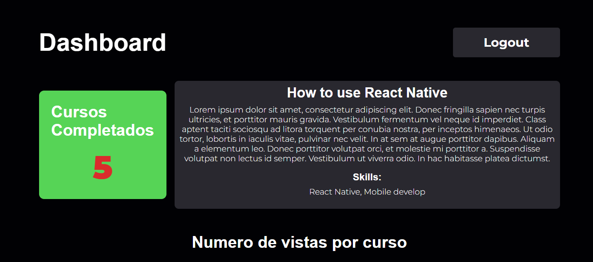
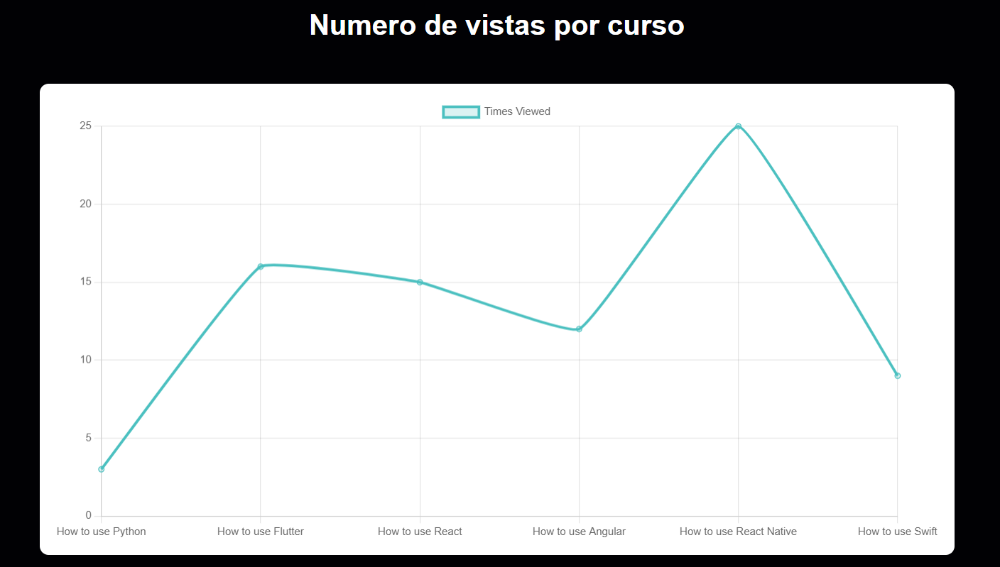

# TalentEvo

TalentEvo es un sistema de entrenamiento corporativo integrado donde los empleados pueden acceder a cursos para expandir sus conocimientos y habilidades requeridas por la empresa. También cuenta con un panel para recursos humanos para monitorear el progreso de los empleados, los cursos completados, las vacantes existentes y recibir recomendaciones personalizadas sobre los empleados.

## Instrucciones de Instalación y Ejecución

### Requisitos Previos

- Node.js (versión 14 o superior)
- npm (versión 6 o superior)
- Cuenta de Firebase para la autenticación y Firestore

### Instalación

1. Clona este repositorio:
    ```bash
    git clone https://github.com/Eduardoespl/TalentEvoPC
    cd talentevo
    ```

2. Instala las dependencias:
    ```bash
    npm install
    ```

3. Crea un archivo `.env` en la raíz del proyecto y agrega tu configuración de Firebase:
    ```plaintext
    VITE_FIREBASE_API_KEY=your_api_key
    VITE_FIREBASE_AUTH_DOMAIN=your_auth_domain
    VITE_FIREBASE_PROJECT_ID=your_project_id
    VITE_FIREBASE_STORAGE_BUCKET=your_storage_bucket
    VITE_FIREBASE_MESSAGING_SENDER_ID=your_messaging_sender_id
    VITE_FIREBASE_APP_ID=your_app_id
    ```

4. Inicia la aplicación en modo desarrollo:
    ```bash
    npm run dev
    ```

5. Abre [http://localhost:5173](http://localhost:5173) en tu navegador.

### Despliegue en Vercel

La aplicación está desplegada en Vercel. Puedes acceder a ella en la siguiente URL: [https://talent-evo-4e0z9u9rd-eduardo-espiritus-projects.vercel.app/](https://talent-evo-4e0z9u9rd-eduardo-espiritus-projects.vercel.app/)

## Descripción del Proyecto

### Estructura del Proyecto
* talentevo/
* ├── public/
* │ └── index.html
* ├── src/
* │ ├── assets/
* │ │ └── office.jpg
* │ ├── components/
* │ │ ├── completedCourses.tsx
* │ │ ├── completedCoursesCard.tsx
* │ │ ├── coursesChart.tsx
* │ │ ├── empleadoCard.tsx
* │ │ ├── empleadoList.tsx
* │ │ ├── PopularCourse.tsx
* │ │ ├── PopularCourseCard.tsx
* │ │ ├── vacancyCard.tsx
* │ │ └── vacancyList.tsx
* │ ├── firebase/
* │ │ └── config.ts
* │ ├── hooks/
* │ │ ├── useCompletedCourses.tsx
* │ │ ├── useCoursesData.tsx
* │ │ ├── useEmpleados.tsx
* │ │ ├── usePopularCourse.tsx
* │ │ └── useVacantes.tsx
* │ ├── styles/
* │ │ ├── App.css
* │ │ ├── completedCoursesStyles.css
* │ │ ├── dashboardStyles.css
* │ │ ├── popularStyles.css
* │ │ └── vacancyStyles.css
* │ ├── Dashboard.tsx
* │ ├── Login.tsx
* │ ├── main.tsx
* │ ├── Register.tsx
* │ ├── routes.tsx
* │ ├── setupTests.ts
* │ └── vite-env.d.ts
* ├── .env
* ├── package.json
* ├── vite.config.ts
* └── README.md


### Uso del Proyecto

- **Login:** Pantalla de inicio de sesión donde los usuarios pueden autenticarse.
- **Register:** Pantalla de registro donde los usuarios pueden crear una nueva cuenta.
- **Dashboard:** Panel principal donde los usuarios pueden ver su progreso y acceder a los cursos.

## Prototipos de la Vista y Cómo Utilizarlas

### Pantalla de Login


1. **Correo Electrónico:** Ingresa tu correo electrónico en el campo proporcionado.
2. **Contraseña:** Ingresa tu contraseña.
3. **Iniciar Sesión:** Haz clic en el botón "Iniciar sesión" para autenticarte.
4. **Registro:** Haz clic en el enlace "No tengo una cuenta" para ir a la pantalla de registro.

### Pantalla de Registro


1. **Correo Electrónico:** Ingresa tu correo electrónico en el campo proporcionado.
2. **Contraseña:** Ingresa tu contraseña.
3. **Registrarse:** Haz clic en el botón "Registrarse" para crear una nueva cuenta.

### Dashboard





1. **Cursos Completados:** Muestra los cursos completados por el usuario.
2. **Curso Populare:** Muestra el curso más popular apartir de el numero de veces realizado, muestra el titulo, la descripcion y las skills que se adquieren.
3. **Numero de vistas por curso:** Muestra el numero de veces que se ha realizado cada curso en forma de grafico.
4. **Empleados:** Muestra la lista de empleados con su nombre y puesto.
5. **Vacantes:** Muestra la lista de vacantes disponibles con el nombre del puesto y las skills requeridas.

## Descripción de las Pruebas y Cómo Ejecutarlas

### Pruebas

Las pruebas se han escrito utilizando `@testing-library/react` y `vitest`.

### Ejecutar las Pruebas

1. Asegúrate de haber instalado todas las dependencias.
2. Ejecuta el siguiente comando para correr las pruebas:
    ```bash
    npm run test
    ```

3. Los resultados de las pruebas se mostrarán en la consola.

### Pruebas Específicas

- **Prueba de Renderizado de Login:** Verifica que la pantalla de login se renderiza correctamente.
- **Permite al usuario autenticarse:** Verifica que el usuario puede autenticarse correctamente.
- **Prueba de Renderizado de Register:** Verifica que la pantalla de registro se renderiza correctamente.
- **Permite al usuario registrarse:** Verifica que el usuario puede registrarse correctamente con un correo y una contraseña.- **Crear un usuario en firebase:** Verifica que se crea un nuevo usuario en Firebase cuando el usuario se registra.
- **Prueba de Renderizado de Dashboard:** Verifica que el panel principal se renderiza correctamente.
- **Debe permitir cerrar sesión:** Verifica que el usuario puede cerrar sesión correctamente al hacer clic en el botón de cerrar sesión.
- **Renderiza todos los componentes:** Verifica que todos los componentes se renderizan correctamente en el panel principal.
- **Render CompletedCourses:** Verifica que el componente CompletedCourses se renderiza correctamente.

```typescript
import { render, screen, fireEvent } from '@testing-library/react';
import Login from '../Login';
import Register from '../Register';
import Dashboard from '../Dashboard';
import CompletedCourses from '../components/completedCourses';
import { createUserWithEmailAndPassword, signOut } from 'firebase/auth';
import { BrowserRouter } from 'react-router-dom';
import { vi } from 'vitest';

vi.mock('firebase/auth', () => ({
  createUserWithEmailAndPassword: vi.fn(),
}));

vi.mock('../src/firebase/config', () => ({
  auth: vi.fn(),
}));

test('should call createUserWithEmailAndPassword when user submits form', () => {
        render(
            <BrowserRouter>
                <Register />
            </BrowserRouter>
        );

        const emailInput = screen.getByPlaceholderText('Correo');
        const passwordInput = screen.getByPlaceholderText('Contraseña');
        const button = screen.getByText('Registrarse');
        fireEvent.change(emailInput, { target: { value: 'test@example.com' } });
        fireEvent.change(passwordInput, { target: { value: 'password' } });
        fireEvent.click(button);
        expect(createUserWithEmailAndPassword).toHaveBeenCalled();
    });
